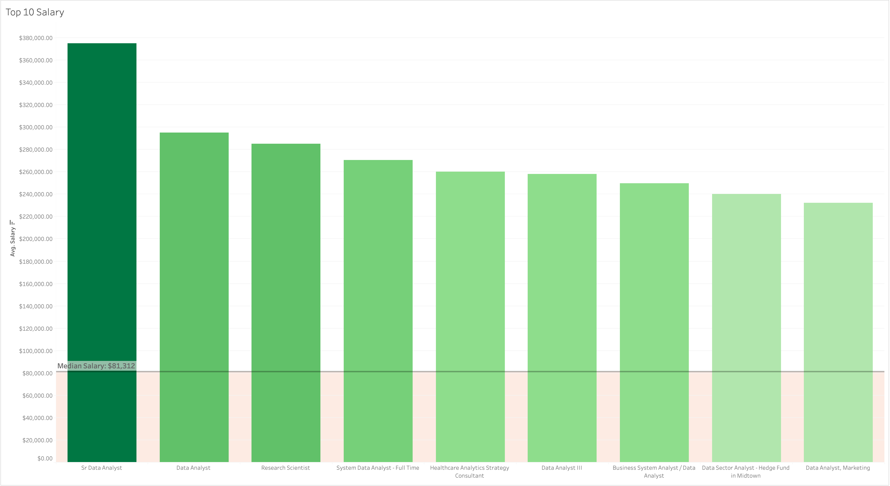
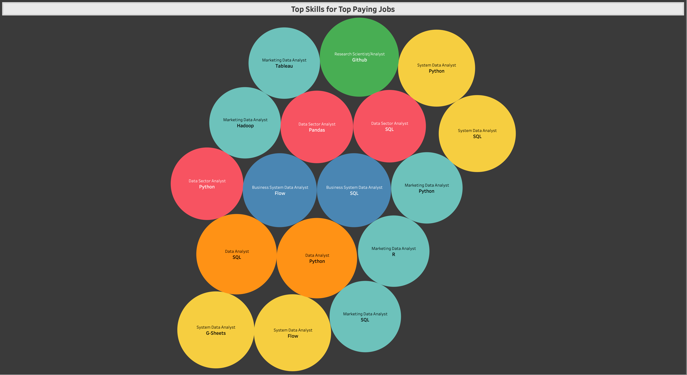
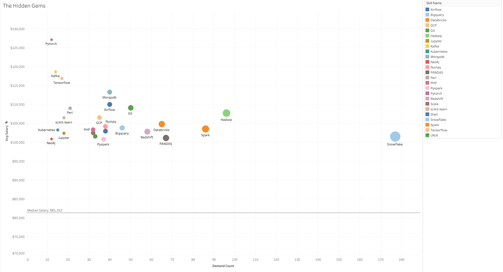
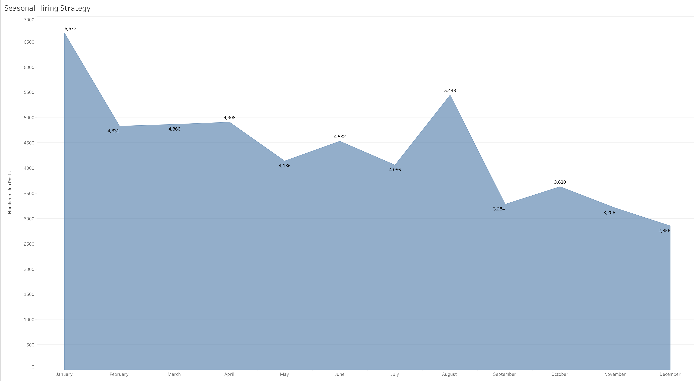
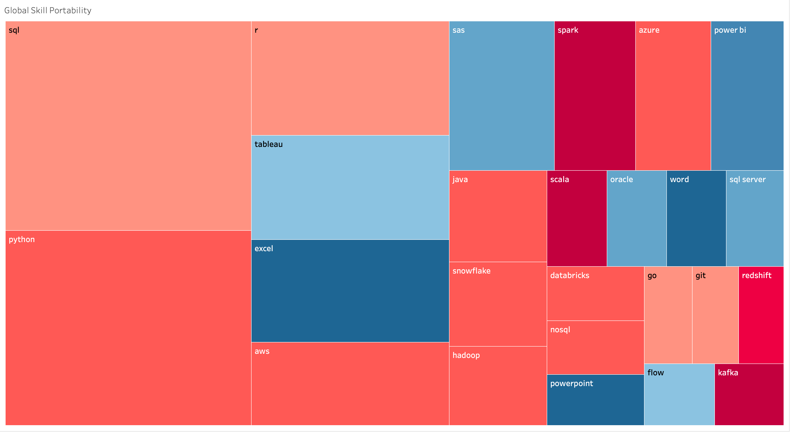

# Data Market Intelligence: 2023 Job Market Analysis

An early SQL and Tableau project exploring patterns in a 2023 data-job-postings dataset.

I built this while developing my SQL and PostgreSQL skills. The project uses a local PostgreSQL database, six analytical queries, and Tableau views to examine salary listings, skills, posting volume, and cross-role patterns.

This README focuses on the technical work. The portfolio case study will carry the shorter narrative and reflection.

## Questions explored

The analysis asks six practical questions:

1. Which US full-time Data Analyst listings return the highest standardized salaries?
2. Which skills are attached to those top-returned listings?
3. Which relatively uncommon skills also have higher average listed salaries?
4. How does Data Analyst posting volume change by month in the 2023 dataset?
5. How do employers compare on posting volume and average listed salary?
6. Which skills appear across Data Analyst, Data Scientist, and Data Engineer postings?

## Data model

The project uses four relational tables:

- `job_postings_fact` — job IDs, titles, locations, posting dates, salary fields, and related job attributes
- `company_dim` — company metadata
- `skills_dim` — skill names and categories
- `skills_job_dim` — bridge table connecting job postings to skills

The setup SQL defines primary and foreign keys and creates indexes on the main join keys.

## Repository structure

```text
.
├── README.md
├── Assets/
│   ├── Data_Schema.png
│   ├── q1_top10_paying_jobs.png
│   ├── q2_skills_for_top10_jobs.png
│   ├── q3_the_hidden_gems.png
│   ├── q4_seasonal_hiring_strategy.png
│   ├── q5_Company_Quality _quantity.png
│   └── q6_global_skill_portability.png
├── data_jobs_analysis/
│   ├── 1_top_paying_jobs.sql
│   ├── 2_skills_for_top_paying_jobs.sql
│   ├── 3_01_validation.sql
│   ├── 3_market_saturation_vs_oppty.sql
│   ├── 4_seasonal_hiring_strategy.sql
│   ├── 5_comp_quantity_vs_quality.sql
│   └── 6_global_skill_portability.sql
├── sql_load/
│   ├── 1_create_database.sql
│   ├── 2_create_tables.sql
│   └── 3_modify_tables.sql
└── validation_sql/
```

The raw CSV files and exported query-result CSVs are intentionally not tracked in this repository.

## Database setup

The `sql_load/` scripts create the PostgreSQL tables and relationships used in the analysis.

Technical details include:

- primary keys on the dimension/fact tables
- a composite primary key on `skills_job_dim`
- foreign-key relationships between jobs, companies, and skills
- indexes on `company_id`, `skill_id`, and `job_id`
- CSV loading through PostgreSQL `COPY`

The current load script contains local file paths from the machine where the project was built. If you run this project yourself, those paths need to be replaced with paths to your local copies of the source CSV files.

## Analysis

### 1. Top-paying Data Analyst listings

[`data_jobs_analysis/1_top_paying_jobs.sql`](data_jobs_analysis/1_top_paying_jobs.sql)

This query filters for:

- `job_title_short = 'Data Analyst'`
- United States
- full-time postings
- available salary data
- several seniority/leadership-title exclusions

Hourly salary values are annualized using a 2,080-hour multiplier where needed. A median benchmark is calculated with `PERCENTILE_CONT(0.5)`.

The query returns the top 10 rows by standardized yearly salary.

**Known limitation:** the title filters exclude words such as `Senior`, but do not catch every abbreviation or title variation such as `Sr`.



### 2. Skills associated with the top-returned listings

[`data_jobs_analysis/2_skills_for_top_paying_jobs.sql`](data_jobs_analysis/2_skills_for_top_paying_jobs.sql)

This query reuses the top-paying cohort and joins it to `skills_job_dim` and `skills_dim` to inspect which skills are associated with those listings.

Techniques used:

- CTEs
- joins across fact and dimension tables
- reuse of the median benchmark



### 3. Relatively uncommon skills with higher average salaries

[`data_jobs_analysis/3_market_saturation_vs_oppty.sql`](data_jobs_analysis/3_market_saturation_vs_oppty.sql)

This query looks for skills that:

- appear in more than 10 matching postings
- appear in fewer than 5% of a calculated posting denominator
- have salary data available

It compares each skill's average standardized salary with the same median benchmark used elsewhere in the analysis.

**Interpretation note:** low posting frequency is not the same thing as low applicant competition. This query measures prevalence in the posting sample, not the number of applicants competing for each role.

**Method note:** the denominator used for the 5% threshold is broader than some of the later seniority-filtered result logic, so the threshold should be read as a project-specific screen rather than a universal market definition.



### 4. Monthly posting volume

[`data_jobs_analysis/4_seasonal_hiring_strategy.sql`](data_jobs_analysis/4_seasonal_hiring_strategy.sql)

This query groups matching Data Analyst postings by month using:

- `TO_CHAR`
- `EXTRACT`
- chronological month ordering

The result shows the posting pattern inside this 2023 dataset. It should not be treated as a universal rule about the best month to apply for jobs.



### 5. Employer posting volume vs. average salary

[`data_jobs_analysis/5_comp_quantity_vs_quality.sql`](data_jobs_analysis/5_comp_quantity_vs_quality.sql)

This query compares employers using two measures:

- number of matching postings
- average standardized salary

Only employers with more than 10 matching postings are included.

The original filename uses "quality vs. quantity," but the query does not measure overall employer or job quality. It measures posting volume and average listed salary.


### 6. Skills shared across data-role categories

[`data_jobs_analysis/6_global_skill_portability.sql`](data_jobs_analysis/6_global_skill_portability.sql)

This query looks across:

- Data Analyst
- Data Scientist
- Data Engineer

For each skill it calculates:

- number of role categories in which the skill appears
- total posting demand
- average standardized salary

The query keeps skills appearing across at least two of the three role categories.

This is a cross-role posting analysis. It does not measure lifetime earnings, career resilience, or individual career progression.



## Tableau

The SQL results were used to create Tableau views for visual exploration.

[View the Tableau project](https://public.tableau.com/views/JobMarketAnalysis_17745897577470/Top10Salary?:language=en-US&:sid=&:redirect=auth&:display_count=n&:origin=viz_share_link)

The screenshots in `Assets/` are retained as visual references from that analysis.

## SQL techniques used

Across the six queries, the project uses:

- PostgreSQL
- relational joins
- common table expressions
- `PERCENTILE_CONT`
- `AVG`, `COUNT`, and grouped aggregations
- `COALESCE`
- salary standardization
- `TO_CHAR`
- `EXTRACT`
- filtering and threshold logic
- basic result validation

## What I learned

This was one of my earlier SQL projects, so the value for me was less about producing a definitive market model and more about learning how to turn broad questions into queries I could inspect and compare.

The project helped me practice:

- structuring a relational database locally
- joining fact and dimension tables
- breaking larger questions into smaller SQL analyses
- creating a consistent benchmark across multiple queries
- moving query results into Tableau for visual review
- recognizing where a query result supports an observation and where interpretation can go too far

## Notes on reproducibility

The repository preserves the SQL, schema setup, and screenshots, but it does not include the raw source CSV files or exported result CSVs.

To reproduce the analysis exactly, you would need the same source dataset and would need to update the local file paths in `sql_load/3_modify_tables.sql` before loading the data.

This project is kept as an early portfolio/learning project rather than a production analytics package.